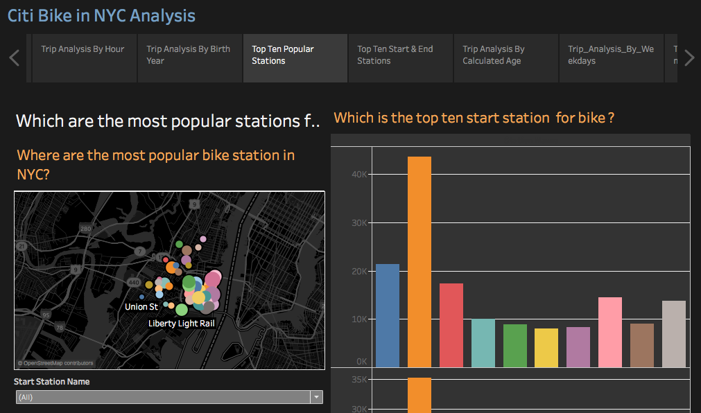
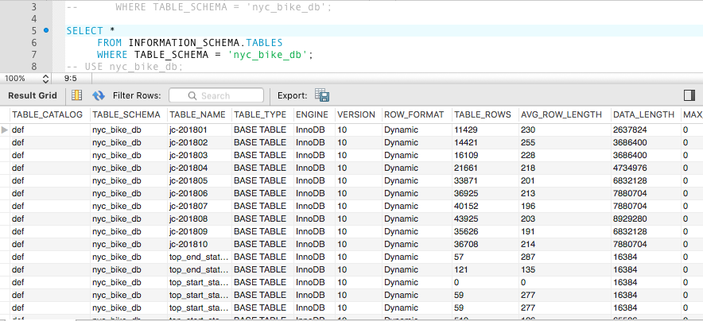

# NYC-city_bike_analysis_Tableau

## Introduction:
   The following project will ”tell a story" through data visualizations.
It will aggregate the data found in the Citi Bike Trip History Logs to build a data dashboard, story, or report.

### Project Introduction:
  Answer the following questions :
* Today, what are the top 10 stations in the city for starting a journey? (Based on data, why do you hypothesize these are the top locations?)
* Today, what are the top 10 stations in the city for ending a journey? (Based on data, why?)
* Today, what are the bottom 10 stations in the city for starting a journey? (Based on data, why?)
* Today, what are the bottom 10 stations in the city for ending a journey (Based on data, why?)
* Today, what is the gender breakdown of active participants (Male v. Female)?
* How effective has gender outreach been in increasing female ridership over the timespan?
* How does the average trip duration change by age?
* What is the average distance in miles that a bike is ridden?

## Technical Requirement: 
  1. Visualization must include Tableau and Python/SQL or any other to cleanse and aggregrate Data

## Data Sources: 
  * City Bike Data Zip files  https://www.citibikenyc.com/system-data  

## ETL Processes: 
 ### Extract:
   Zip data files were loaded and extracted the City Bike Data Site to local SQL workbench.

 ### Transform:
   The tables in SQL were then aggregated and grouped using the following queries to get final top 10 stations.
   USE nyc_bike_db;
   DROP TABLE IF EXISTS top_stop_station_with_name;
   CREATE TABLE top_stop_station_with_name
    (station_id INT, count_stop_station_id INT, station_name VARCHAR(500));

      INSERT INTO top_stop_station_with_name (station_id, count_stop_station_id, station_name)
	
       -- Subquery
       select `end station id`, count(`end station id`) as count_stop_station_id, `end station name` from nyc_bike_db.`jc-201810` group by `end station id`, `end station name` Order by count_stop_station_id desc; 
 

 

 
### Visualize: .
 In tableau, "JC-201810-citbike-tripdata.csv" table was combined with "top_start_station_with_name.csv" and "top_stop_station_with_name_all.csv". Also, since gender values were "0","1","2" with "0" corresponding to "Unknown","1" corresponding to "male" and "2" corresponding to "female", additional column was created called "Gender_value" with their correct name rather than number codes.
 Now various measured values and calculated values such as "Age", "weekdays" etc. were plotted in various charts and graphs.
 Finally, the dashboards were merged and imported to story points. 

## Conclusion and Trends:
  ### Most Popular Start Station:
  Most of the bike start station are concentrated around "Jersey City". According to NJ.com (new jersey city website),
  Jersey City is 13th worst city in the country for drivers because of the high car insurance rates and gas prices typical of the New Jersey-New York metropolitan area. Other factors to add to traffic misery include  more local issues like constant road closures and construction in the surrounding area.

  ### Most Peak Hour for Bike Use:
  According to the chart, 8am and 6pm were the most peak hour for the bike use. Average trip duration in those hours were at peak for the month of October, 2018.

  ### Top Ten Bike Start Stations:
  "Grove St Path " was the most popular bike start station and end station over the period of Jan 2018 to October 2018. The start station and end stations were counted for each trips in a month table and aggregated over 10 months. "Exchange Place" was second popular start station but "Hamilton Park" was the second most popular end stations over the same period.

  ### Popularity by Age
  Age 49 and Age 30 were the most popular age to rent the bike among other ages.

  ### Popularity by WeekDay
  Friday and Sunday are the most popular days for bike rental. Average Trip Duration for female is higher on Sunday and average trip duration for male is higher on Friday.

  ### Popularity by Gender
  Though overall trip duration is higher for male than female. In average, female made more "average trip duration" than male in the month of October. 2018.

  ### Customer Vs Subscriber
  The Subscriber is triple the amount of customer in Month of October, 2018.

Author : Chol Grg